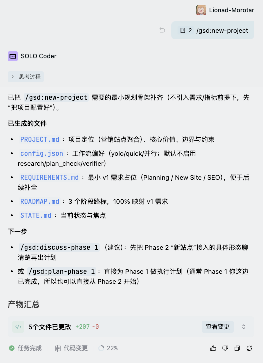

# GSD for Trae

为 [Trae](https://www.trae.ai/) 适配的 GSD（Get Shit Done）框架版本，aka get-shit-done-trae or gsd-trae。

GSD 是一个轻量级、强大的元提示（Meta-prompting）、上下文工程（Context Engineering）和规格驱动开发（Spec-driven Development）系统。

## 什么是 GSD

GSD 通过流程约束解决了**上下文衰减（Context Rot）**问题——当 Claude 的上下文窗口被填满时，代码质量会逐渐下降的现象。

它通过以下方式实现：

- **上下文工程**：在 `.planning/` 目录中持久化项目上下文
- **智能体编排（Subagent Orchestration）**：并行调度多个专业 Agent 完成复杂任务
- **状态管理**：跟踪项目进度，支持断点续传
- **目标回溯验证（Goal-backward Verification）**：确保每个阶段真正达成目标

## 本项目

这是 GSD 的 **Trae 适配版本**，将 GSD 的强大工作流引入 Trae IDE：

| 特性                           | 说明                                                           |
| ------------------------------ | -------------------------------------------------------------- |
| `.trae/rules/project_rules.md` | Trae 项目级规则，替代 `.claude/` 目录                          |
| 完整工作流支持                 | `/gsd:new-project`、`/gsd:plan-phase`、`/gsd:execute-phase` 等 |
| 中文优化                       | 针对中文开发者优化的提示和文档                                 |

注意，GSD 的提示词是为 Claude 优化的，如果在 Trae 中使用，个人推荐使用 Gemini-3-pro、Kimi K2.5、GLM-5，减少使用 GPT 5.2

## 快速开始

### 方式一：使用 npx（推荐）

在项目根目录运行：

```bash
npx gsd-trae
```

### 方式二：使用 curl

在项目根目录运行：

```bash
bash <(curl -s https://raw.githubusercontent.com/Lionad-Morotar/get-shit-done-trae/main/install.sh)
```

### 方式三：手动安装

1. 克隆本仓库到固定位置：

```bash
git clone https://github.com/Lionad-Morotar/get-shit-done-trae.git ~/.config/gsd-trae
```

2. 运行安装脚本：

```bash
bash ~/.config/gsd-trae/install.sh
```

### 开始工作

安装完成后，在 Trae 的 AI 对话中输入：

```
/gsd:new-project
```



## 核心命令

| 命令                   | 用途                                      |
| ---------------------- | ----------------------------------------- |
| `/gsd:new-project`     | 初始化新项目：提问 → 研究 → 需求 → 路线图 |
| `/gsd:discuss-phase N` | 收集第 N 阶段的上下文                     |
| `/gsd:plan-phase N`    | 为第 N 阶段创建详细计划                   |
| `/gsd:execute-phase N` | 执行第 N 阶段的所有计划                   |
| `/gsd:verify-work`     | 验证交付物是否符合要求                    |
| `/gsd:progress`        | 检查项目进度                              |
| `/gsd:map-codebase`    | 分析现有代码库                            |

## 工作流程

### 新项目（Greenfield）

```
/gsd:new-project
   ↓
深度提问 → 研究（可选）→ 定义需求 → 创建路线图
   ↓
/gsd:discuss-phase 1 → /gsd:plan-phase 1 → /gsd:execute-phase 1
   ↓
/gsd:verify-work
   ↓
进入 Phase 2...
```

### 已有代码（Brownfield）

```
/gsd:map-codebase      # 先分析现有代码
   ↓
/gsd:new-project       # 基于现有上下文规划新功能
```

## 参考

- [GSD 原项目](https://github.com/glittercowboy/get-shit-done) - 官方仓库

## 工作原理

安装脚本 `install.sh` 会执行以下操作：

1. 将 GSD 源文件克隆到 `~/.gsd-source`
2. 在当前项目创建 `.trae/rules/project_rules.md`
3. `project_rules.md` 中的链接指向 `~/.gsd-source` 下的实际文件

这样多个项目可以共享同一份 GSD 源文件，同时每个项目有自己的 Trae 规则配置。

## 许可证

MIT License
