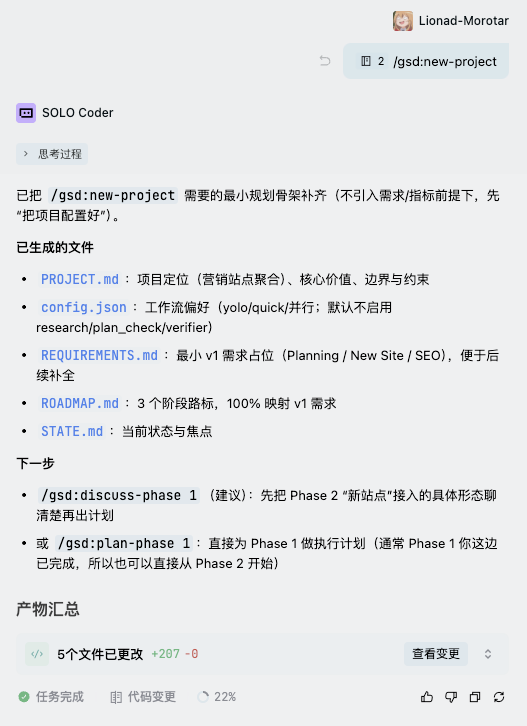

# GSD for Trae

为 [Trae](https://www.trae.ai/) 适配的 GSD（Get Shit Done）框架版本，aka get-shit-done-trae or gsd-trae。

GSD 是一个轻量级、强大的元提示（Meta-prompting）、上下文工程（Context Engineering）和规格驱动开发（Spec-driven Development）系统。

## 什么是 GSD

GSD 通过流程约束解决了**上下文衰减（Context Rot）**问题——当 Claude 的上下文窗口被填满时，代码质量会逐渐下降的现象。

它通过以下方式实现：

- **上下文工程**：在 `.planning/` 目录中持久化项目上下文
- **智能体编排（Subagent Orchestration）**：并行调度多个专业 Agent 完成复杂任务
- **状态管理**：跟踪项目进度，支持断点续传
- **目标回溯验证（Goal-backward Verification）**：确保每个阶段真正达成目标

## 本项目

这是 GSD 的 **Trae 适配版本**，将 GSD 的强大工作流引入 Trae IDE。

**版本策略**：`gsd-trae` 的版本号与 GSD 上游保持同步。当前版本 `v1.36.0` 对应 GSD `v1.36.0`。

| 特性                           | 说明                                                           |
| ------------------------------ | -------------------------------------------------------------- |
| `.trae/rules/project_rules.md` | Trae 项目级规则，替代 `.claude/` 目录                          |
| 完整工作流支持                 | `/gsd-new-project`、`/gsd-plan-phase`、`/gsd-execute-phase` 等 |
| 中文优化                       | 针对中文开发者优化的提示和文档                                 |

注意，GSD 的提示词是为 Claude 优化的，如果在 Trae 中使用，个人推荐使用 Gemini、Kimi、GLM-5，减少使用 GPT

## 快速开始

### 方式一：使用 npx（推荐）

在项目根目录运行：

```bash
npx -y gsd-trae@latest
```

### 卸载

```bash
npx -y gsd-trae@latest uninstall
```


### 开始工作

安装完成后，在 Trae 的 AI 对话中输入 GSD 指令即可开始。以下是一个示例：

```
/gsd-new-project
```



## 工作流程

### 从已有代码开始（Brownfield）

```
/gsd-map-codebase      # 先分析现有代码
   ↓
/gsd-new-project       # 基于现有上下文规划新功能
```

### 新项目（Greenfield）

```
/gsd-new-project
   ↓
深度提问 → 研究（可选）→ 定义需求 → 创建路线图
   ↓
/gsd-discuss-phase 1 → /gsd-plan-phase 1 → /gsd-execute-phase 1
   ↓
/gsd-verify-work
   ↓
进入 Phase 2...
```

## 工作原理

安装脚本 `install.sh` 会执行以下操作：

1. 将 GSD 源文件克隆到 `~/.gsd-source`
2. 创建符号链接 `~/.gsdc` → `~/.gsd-source/commands/gsd`
3. 在当前项目创建 `.trae/rules/project_rules.md`

这样：
- 多个项目共享同一份 GSD 源文件
- 通过 `~/.gsdc/{command}.md` 统一访问命令文档
- 每个项目有自己的 Trae 规则配置

## Reference

- [GSD V1](https://github.com/glittercowboy/get-shit-done) - 官方仓库

## 许可证

MIT License
